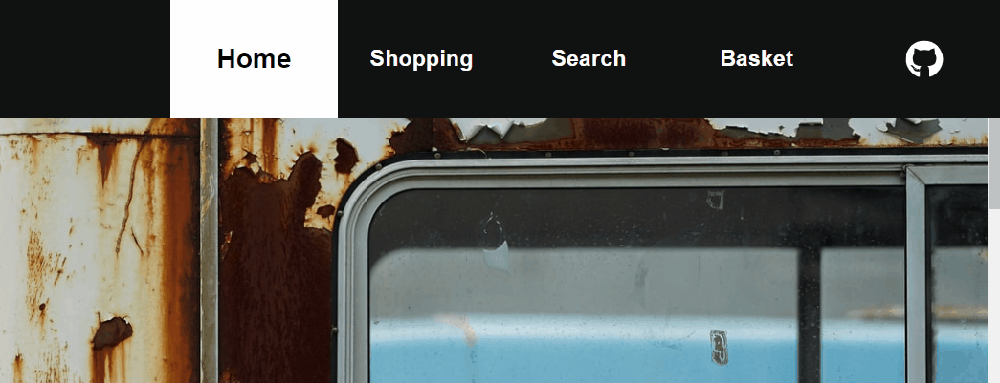

# shopping-cart
shopping cart page based off the Odin project curriculum. Users can browse various products in the catalogue and add to basket. Live demo can be found on github.io [here](https://sasountorossian.github.io/shopping-cart/). 


Main emphasis of this project was the design aspect, having become comfortable with React and react-routing-dom from the previous two projects. Made use of online wireframe tools to get the best look. Theme of the webpage is an overly pretentious, minimalist, tongue-in-cheek art exhibition which gave me an excuse to brush the dust off my DSLR camera.

In a change from previous React projects, styling was mainly CSS, since I felt that it gave me much greater control over the fine details of the page, as opposed to Material-Ui which, similar to Bootsrap, can lead to all webpage looking somewhat samey (At least in the hands of an amateur). This also allowed me to experiment with sticky scroll on the home page, which is a nice touch.

Project's javascript logic was relatively straightforward, leaving plenty of time to focus on the design of the webpage. The exception to the easy javascript however was the implementation of the modal search function. This required some playing around with the routing library switching, having to pass a prop of the current location to the <Switch> element in App.js which would render the search bar, while figuring out the previous location in order to render it underneath the modal. It also required me to get the positioning of the Search tab in the header, in order to align the search input box with it.
  
Here, I use refs to measure the distance between the right border of the header's search button, and the right side of the screen.

### Header.js
```javascript
  const [rightBorderDistance, setRightBorderDistance] = useState(0)
  const searchInput = useRef(null);
  useEffect(() => {
      const element = searchInput.current
      if(element) setRightBorderDistance(window.innerWidth - element.getBoundingClientRect().right)  
  }, [])
```

The NavLink element will pass the current url location in the "previous" state, as well as the rightBorderDistance in the "position" state.

### Header.js
```javascript
  <NavLink to={{
      pathname: "/search",
      state: { previous: location, position: rightBorderDistance},
      }}
      className="nav-bar-search nav-link"
      activeClassName="nav-bar-active"
      ref={searchInput}
  >
```

Here, I check if there is a previous state in the location variable. If so, then render that underneath the modal, and if not just render the normal location.

### App.js
```javascript
  const location = useLocation()
  const previous = location.state && location.state.previous
  
  <Switch location={previous || location}>
  .......
  </Switch>
  
  {previous &&           
    <Route 
        exact path="/search" 
        render={(props) => (
          <SearchModal {...props} position={location.state.position}/>
          )}
    />
  }
```

Upon rendering the modal, align the container with right border of the search tab.

### SearchModal.js
```javascript
  <div 
      className="modal-search-inner" 
      style={{ right: position }} // Align input with search button. 
      onClick={(e) => e.stopPropagation()} 
      onMouseLeave={() => setWrapperShade("dark")}
      onMouseEnter={() => setWrapperShade("light")}
  >
```

### Search demo


Animations were made with framer-motion. The location manipulation that was required for the modal search page made transition-out effects difficult to implement, which is why there are only transition-in effects.

Fun project that allowed me to stretch some design muscles and have fun implementing new ideas and writing some joke descriptions. 
